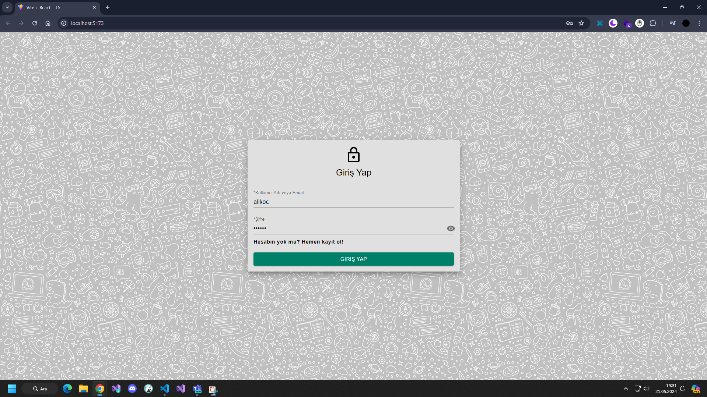
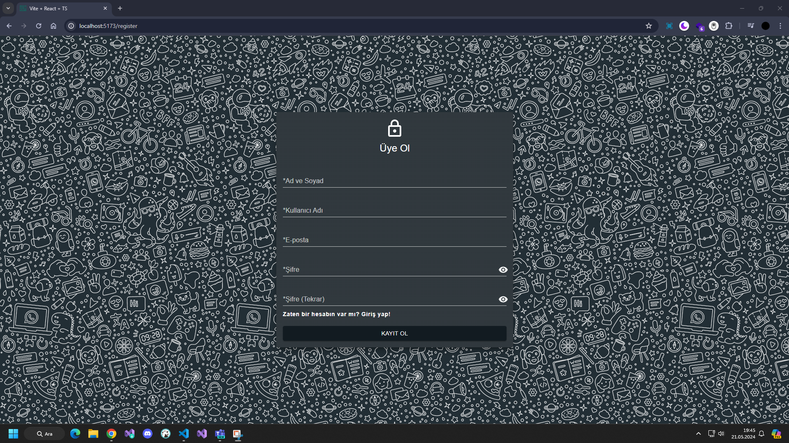
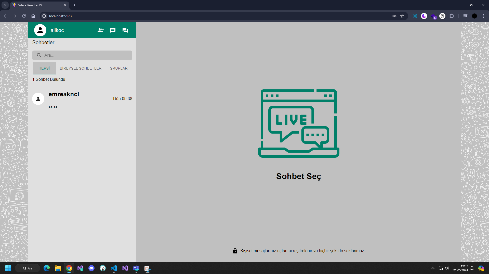
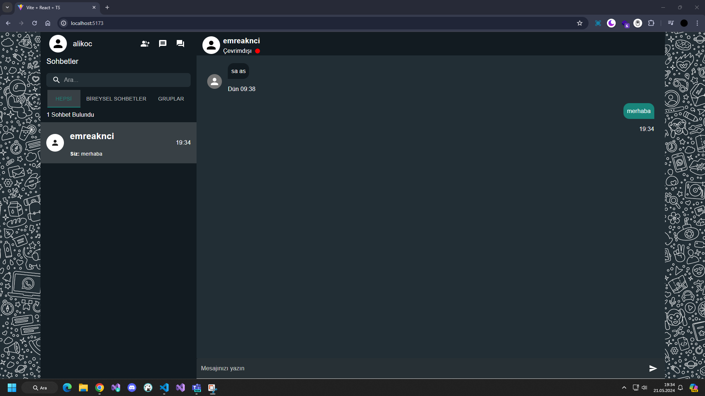
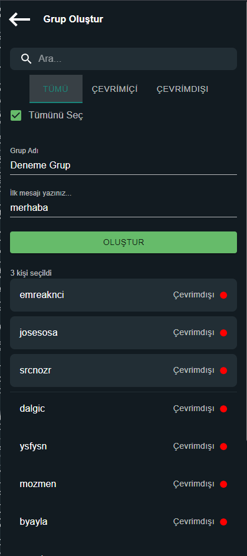
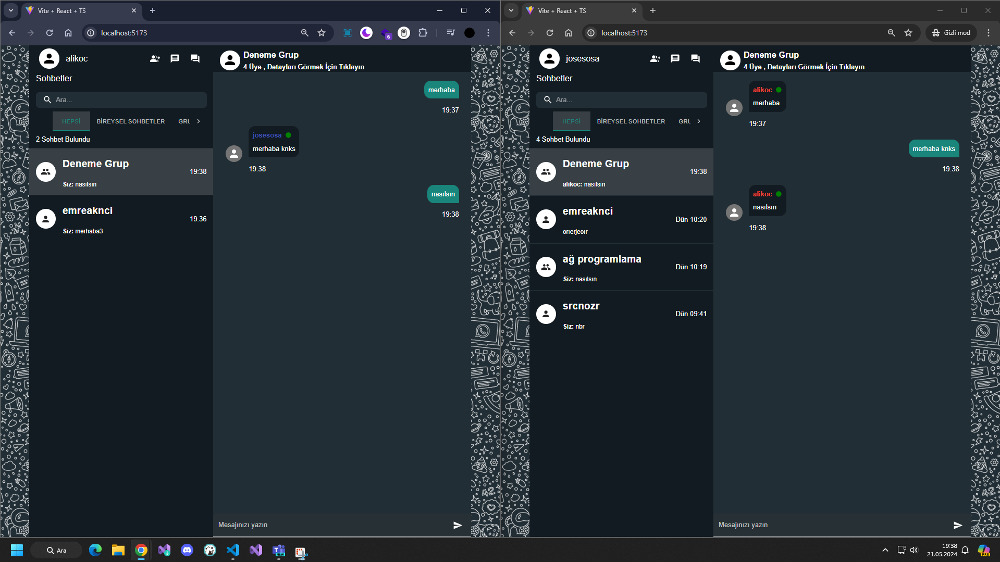

<p align="center">
  
</p>

# Chat App
This application is a messaging application inspired by WhatsApp. It supports individual, group and broadcast messaging.


## Tech Stack

**Client:** React, Material UI

**Server:** Node, Express

**Database:** Mongo


## Environment Variables

Firstly you need to have a mongodb URI. After this, you must change the URI in the .env file in the server app.

`MONGO_URI`


## Installation

The server application runs on port 5000 and the socket runs on port 5001.
The client application runs on port 5173.
If you want, you can change the ports as you wish.

```bash
  git clone https://github.com/emreaknci/ChatApp.git
```


#### For Client App;
```bash
  cd client
  npm install 
  npm start
```
#### For Server App;
```bash
  cd server
  npm install 
  npm start
```


## Some Screenshots


<p align="center">

  | *Login* | *Register* |
  | --- | --- |
  |  |  |

  | *Chats* | *Private Chat* |
  | --- | --- |
  |  |  |

  | *Create Group Chat* | *Group Chat* |
  | --- | --- |
  |  |  |


</p>

    
## Authors

- [@emirhanusta](https://www.github.com/emirhanusta)
- [@emreaknci](https://www.github.com/emreaknci)


